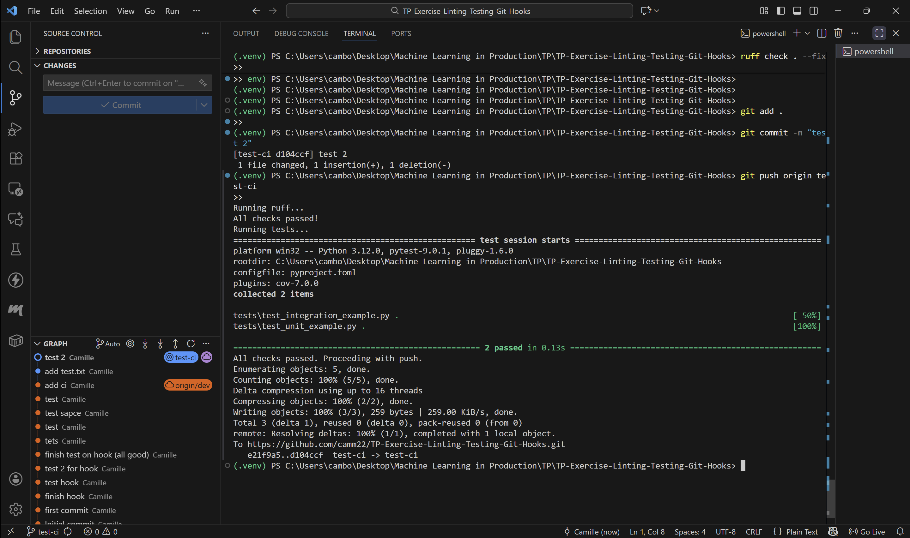
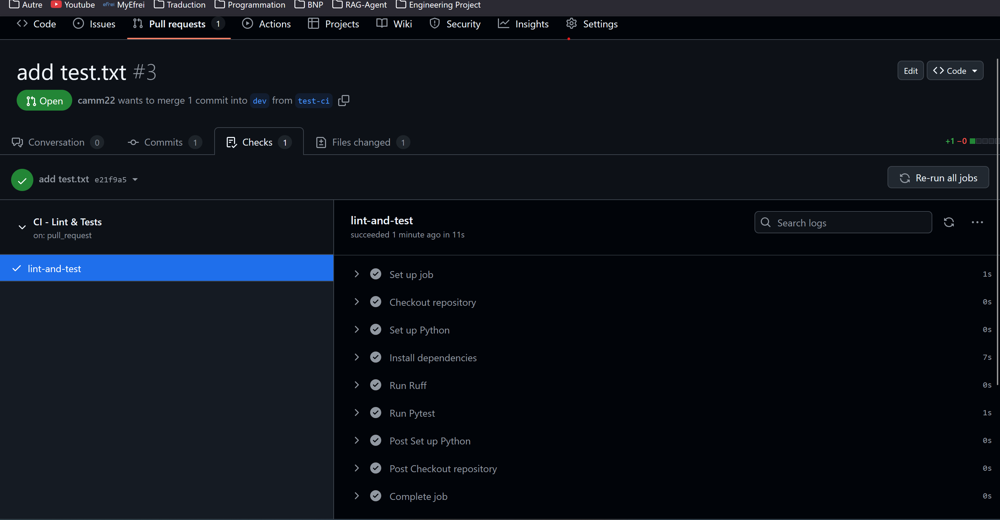
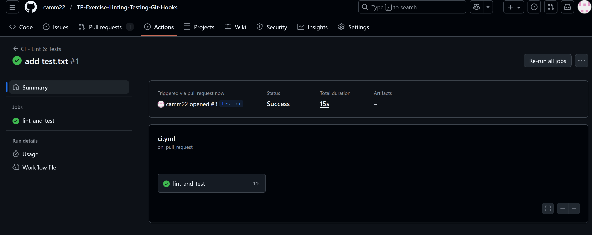
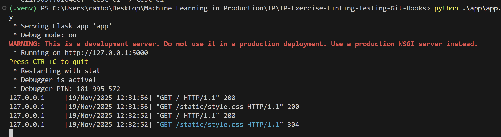

# TP-01 — Machine Learning in Production: Continuous Integration with GitHub and Docker

**Author:** Camille Bordes

**Email:** [camille.bordes@efrei.net](mailto:camille.bordes@efrei.net)

**Group:** DAI

## Requirements

Make sure the following are installed on your system:

- [Python 3.11+](https://www.python.org/downloads/)
- [Git](https://git-scm.com/downloads)

## Running the application locally

### 1. Clone the repository

```bash
git clone https://github.com/camm22/TP-Exercise-Linting-Testing-Git-Hooks.git
```

### 2. Create and activate a virtual environment

```bash
python -m venv .venv

# On Windows
.\.venv\Scripts\activate

# On Mac/Linux
source .venv/bin/activate
```

### 3. Install dependencies

```bash
pip install -r requirements.txt
```

### 4. Run the Flask application

```bash
python app.py
```

The application will be accessible at:
[http://127.0.0.1:5000/](http://127.0.0.1:5000/)

## Demonstrate

All steps of the CI/CD pipeline and local setup were successfully completed. Below are screenshots demonstrating the outputs:

### 1. Local Git hooks output



### 2. Completed GitHub workflow (Checks)





### 4. Application running successfully


